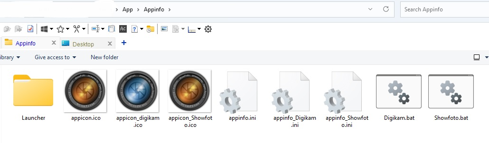
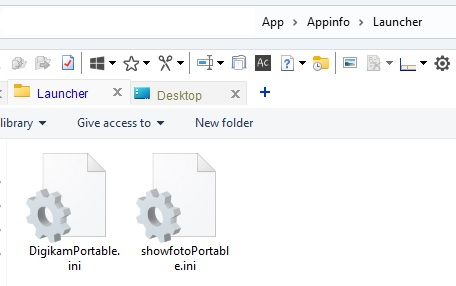
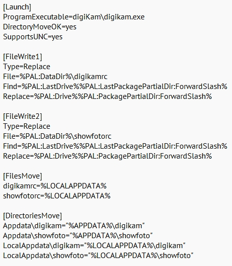
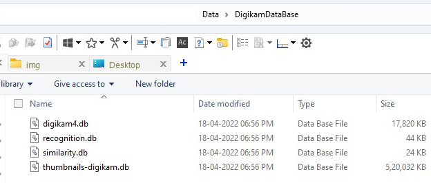
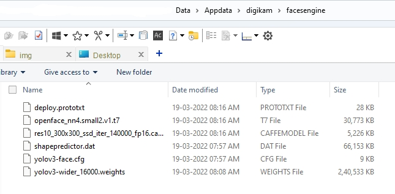

# Portable version of digiKam (Windows version)

digiKam version: 7.6.0

Product webpage: https://www.digikam.org/about/overview/

## What is digiKam?

digiKam is an advanced open-source digital photo  management application that runs on Linux, Windows, and MacOS. The  application provides a comprehensive set of tools for importing,  managing, editing, and sharing photos and raw files.

## Highlights

You can use digiKam’s import capabilities to easily  transfer photos, raw files, and videos directly from your camera and  external storage devices (SD cards, USB disks, etc.). The application  allows you to configure import settings and rules that process and  organize imported items on-the-fly.

digiKam organizes photos, raw files, and videos into  albums. But the application also features powerful tagging tools that  allow you to assign tags, ratings, and labels to photos and raw files.  You can then use filtering functionality to quickly find items that  match specific criteria.

In addition to filtering functionality, digiKam features  powerful searching capabilities that let you search the photo library by a wide range of criteria. You can search photos by tags, labels,  rating, data, location, and even specific EXIF, IPTC, or XMP metadata.  You can also combine several criteria for more advanced searches.  digiKam rely on Exiv2 library to handle metadata tag contents from files to populate the photo library.

digiKam can handle raw files, and the application uses the excellent LibRaw library for decoding raw files. The library is  actively maintained and regularly updated to include support for the  latest camera models.

digiKam can also manage video files for cataloging  purpose, and the application uses the couple FFmpeg and QtAv libraries  to extract metadata and play media.

The application provides a comprehensive set of editing  tools. This includes basic tools for adjusting colors, cropping, and  sharpening as well as advanced tools for, curves adjustment, panorama  stitching, and much more. A special tool based on Lensfun library permit to apply lens corrections automatically on images.

Extended functionality in digiKam is implemented via a set of tools based of plugins mechanism (named DPlugins for digiKam  Plugins). Plugins can be written to import and export contents to remote web-services, add new features to edit image, and batch process photo.

## About This Version 

this is forked version of this kind person [ truefriend-cz ](https://github.com/truefriend-cz) but with portableapps.com format

# Read Carefully Before Launching Digikam

## Manual

### Steps

#### Portable Apps Compiler

1. If one is Familiar with portableapps.com format can compile their own portable apps with two each specific .ini for Digikam and Showfoto. Just Run Bat files to rename and change respective ini file

2. If you want to change the parameters of launcher one can these ini file as in below image.

3. Glimpse of codes in `Digikamportable.Ini` can edit to suit for one’s needs.

   

#### Digikam
##### Data Files

1. This Is the place where Digikam launcher attempts to store the Digikam Database Files required for accessing image manipulation, Image Recoginition, Image Search for duplicates and Thumbnails storage. For processsing large huge image library it is vital to have high speed data drive for smooth workflow.

2. This Is the place where Digikam launcher attempts to store the face engine. This is optional as Digikam portable as it is needed only by showfoto but one can attempt to launch 

   
